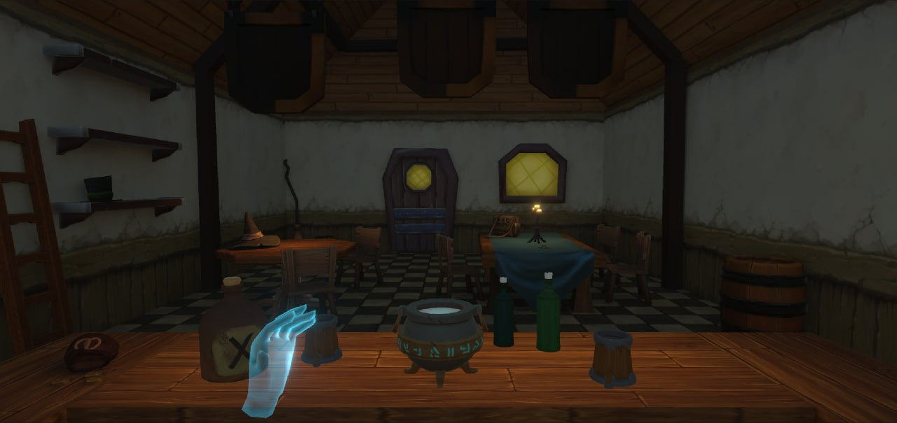

### Team:
Sign-ature Cocktail

## Week 2 - Choosing the Tech Stack, Designing the Architecture #
# Tech Stack Selection 
Python, 3ds Max, Unity, C#, Blender, Topogun, 3DCoat, Substance Painter - we decided to use these because they seemed the most suitable, and the team members also have some experience with them.

# Architecture Design
**Component Breakdown:** Creating a game scene, reading ASL characters, synchronizing the rig with the scene, creating game characters, writing a narrative

**Data Management:** At the moment, we store and record the coordinate data of various hand positions for training and improving the model.

**User Interface (UI) Design:** 

**Integration and APIs:** We did not need to create an API for our project. It consists of several elements: hand tracking using a camera, gesture detection using artificial intelligence, Blender models, and Unity. All final parts of the project will be added to Unity and work within it.

**Scalability and Performance:** The number of users is not limited. Our project is a game that runs on a single device. The game is designed for one person at a time.

**Security and Privacy:** The definition of security is not particularly applicable to our game. It is planned to be free and open access. There is no registration or saving of user data (besides saving the game progress itself). The only place where security could be applied is in sending error data or simply data about the user’s progress to us for further development and debugging of the game. But they, in turn, will be sent only with the user’s consent.

**Error Handling and Resilience:** User progress and error reports.

**Deployment and DevOps:** Our team actively pursues a position of transparency. If someone is unable to implement something, they inform the team so that possible actions can be considered to complete the task. When a person finishes working on their part of the project, they move on to the next one or help other team members with their tasks. Tasks are delegated using “open tasks” in the project table. Everyone can choose a task that they are capable of or interested in, and in the same way, we close them and mark them as completed.

## Week 2 questionnaire: #
**Tech Stack Resources:** We do not use any books for now. For the most part, the team uses the knowledge gained earlier or uses educational videos on YouTube.

**Mentorship Support:** At the moment we do not have a mentor, because we have just started creating our game. In the future, we plan to talk with students from the 3rd year who created a project similar to ours last year. We believe that they will be able to help us in difficult moments, as well as tell us how we can promote our idea to the world.

**Exploring Alternative Resources:** 
We used videos from YouTube like these:
https://www.youtube.com/watch?si=fQdh8Q--ttwzERjt&v=MJCSjXepaAM&feature=youtu.be
https://www.youtube.com/watch?v=a99p_fAr6e4
https://www.youtube.com/watch?v=q_P_4KuAIVw

**Identifying Knowledge Gaps:** We may have problems with Unity integration in the future, but one of our team members is from the game development track. This person has several TAs who can help us if necessary.

**Engaging with the Tech Community:** Some members from our team participate in Gamejam, and we also watched various open online courses to get additional information about our field.

**Learning Objectives:** Smoothing the image while synchronizing with the scene, refining the design and references to a complete idea. Start creating a narrative.

**Sharing Knowledge with Peers:** Our team has meetings several times a week to discuss our progress and the distribution of responsibilities among the team members. We also have a general chat in which we can share necessary additional materials and, if necessary, discuss emerging issues.

**Leveraging AI:** We used AI to determine the movement of the hands and creating orders in the game. If necessary, we can use it to find missing information.

## Tech Stack and Team Allocation 

Team Member (Lead) 1: **Elena Tesmeeva** - organizing team meetings, organizing work, and assigning responsibilities to team members, writing reports.
Team Member 2: **Gleb Pavlov** - responsibilities: ML, working with Alexandra. This week, he completed full ASL character recognition.
Team Member 3: **Aleksandra Kuzmich** - responsibilities: ML, working with Gleb. This week, she completed full ASL character recognition.
Team Member 4: **Nika Lobanova** - responsibilities: game designer, creator of the gameplay and the story of the game.
Team Member 5: **Nikita Rashkin** - responsibilities: game designer, Unity dev., working with rig recognition.

## Weekly Progress Report 
This week, our team decided on the design of the game (now we have a room in which the actions will take place, created in Unity). We also completed the definition of hands through the laptop camera - now we recognize all ASL letters/symbols, can record words, delete letters, and perform other manipulations with them. In addition, a rig of hands has been created, which is currently synchronized with the game scene.

## Challenges & Solutions 
It is necessary to adjust the restrictions for the bends of the fingers, because now sometimes they slip in the wrong direction. We have ideas on how to fix this, and it will definitely be ready next week.

## Conclusions & Next Steps 
Our team has made sufficient progress in the first two weeks. Since our idea is quite complex, we want to spend as much time as possible initially on the most dangerous and difficult moments, so that in the future we have more time to add additional features and develop a narrative.
