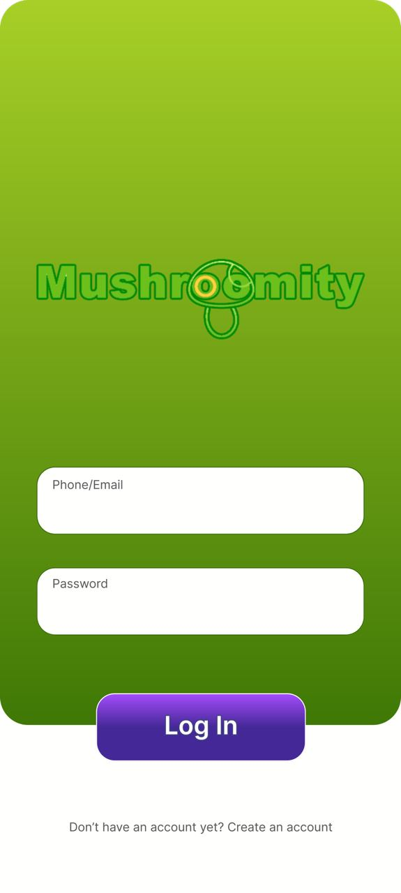

# Week 3 #

This week, we initiated the creation of all components required for the project. We developed the initial UI design for
the primary pages, crafted parsing scripts to automatically generate datasets, and established the back-end systems for
the application. However, we encountered some issues along the way.

## Developing the first prototype, creating the priority list ## 

As we only began working on the project this week, we have yet to produce a functional prototype for users to test.
Nonetheless, we developed a basic frontend system that incorporates the primary functions of the project.

- Technical Infrastructure: To be prepared, we only need from everyone to know how to work with their tech stack and
  some GPUs for training our model:
  - The first 2 weeks our main developers (Gleb and Elmir) reminded Flutter, and for today they are ready to create
    everything our app needs to. They've already created a starter part of the app, but we decided to remove it after
    contacting the professor.
  - Right now we don't need GPUs for training our model because we don't have the model:) But our own GPUs are
    prepared and just waiting.
  - In total, our team has already created all stuff for working together (organization, repositories and projects for
    them). Also, we conducted with the professor, who knows a lot about mushrooms, and now we understand, how to
    prepare the model and create an application.
- Backend Development: Right now we don't have any backend due to we started in a wrong way. There will be explanation
  about it later.
- Frontend Development (UI):
  We have created the first version of the main pages in the app. Next week we will change a bit the design, but now you
  may see this picture:
  - When you open the app, you firstly have to log in or sign
    in:

    
  - After that, you go to the main page, where you can go to other pages or analyze mushroom by
    photo:

    
  - After taking a photo, you go to the page with this photo and description of mushroom in
    it:

    

    The description might be changed, now it's just an example.
  - Of course, you may want to change language or log out. For that, you may go to the settings
    page:

    
  - In addition, in the app you will also be able to chat with other people about any topics you want by using
    forum:

    
- Data Management: All data for models are stored now in Google Drive. We have a parser script that parses some sites,
  takes photos of mushrooms with their names and stores that in some packages. Packages are created in the following
  way:
  There are lots of packages for each family of mushrooms. In each package there are some packages also for each type of
  mushrooms. Finally, in each package there are some photos of mushrooms of this type and family.
- Prototype Testing: We cannot start testing the app because now there's nothing that can be tested.

Simply speaking, we don't have anything to show except design. And it happened because we didn't realize how we have to
analyze mushrooms. Here's some details:

---

## Professional mushroom picker ##

Last week, we mentioned that
`we have invited a professional mushroom picker from Russia to help us learn how to analyze mushrooms`. Unfortunately,
this individual did not show up or respond to our attempts to contact him. Consequently, we began searching for someone
else who could assist us. Finally, this week we spoke with a professor from Kazan Federal University who informed us
that we had misunderstood the problem. Initially, we believed that a photograph of a mushroom would be sufficient to
identify one of the 1,000 types of mushrooms in the world. However, as it turns out, there are more parameters to
consider than just a photo. Additionally, there are 1,000 types of mushrooms in Tatarstan alone. Therefore, we have
decided to focus solely on our region to improve the accuracy of our model in its initial stages. Furthermore, we need
to identify the main parameters that cannot be determined by a photo. For example, a crucial parameter for identifying
the type of mushroom is knowing where it grew. If it grew on a tree, we might also be able to determine the type of
tree. Of course, we cannot include all parameters, or else people would need to spend an excessive amount of time
marking all the details.

---

## Future work ##

Next week, our main objective is to locate high-quality sources containing numerous photos of mushrooms from Tatarstan.
Additionally, we will identify the primary parameters required for mushroom identification and adjust our model by
incorporating these parameters into the photos. Since we cannot provide all the necessary details to the Flutter team,
their task will be to develop other essential features such as  `log in`  and  `page switching` .


**Feedback**  

**Prototype Features** 
Missing section

**User Interface** 
The UI you created is too basic. It look neat though. I would advice you instead of creating everything from scratch you can utilise Figma community. There you can see a lot of pre made design that you can follow or use their components.

PS: Images doesn’t show on the site, you should fix that.

**Challenges and Solutions** 
Missing section, or is it the Mushroom expert guy?
If so, then it’s good that you are trying to find alternative solution.
But think you should keep trying to find an expert this will make your app better.

**Next Steps** 
Good, but how will you secure those images?

**Overall** 
Please stick to the report template and provide answers to what is requested.
For example where are your features? Challenges?

**Grade  4/5**

_Feedback by Moofiy_
